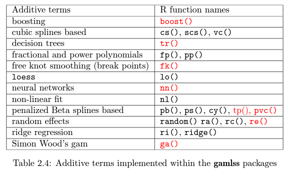

```{r setup, include=FALSE}
knitr::opts_chunk$set(echo = TRUE)
```

```{r echo = FALSE}
# Install packages - Uncomment when you run for the first time
# install.packages(c("gamlss","gamlss.add","gamlss.dist"))
# install.packages("psych")
# install.packages("tidyverse")
# install.packages('skimr')
# install.packages('esquisse')
# install.packages('miniUI')
# install.packages("cowplot")
# install.packages("DataCombine")
# install.packages('lubridate')
# install.packages("ggpubr")
# install.packages("MASS")
# install.packages('forecast', dependencies = TRUE)
# install.packages("Hmisc")
# install.packages("Boruta")
# Load Required Packages
# GAMLSS packages
library(gamlss)
library(gamlss.add)
library(gamlss.dist)

# package that stiched together many R packages
library(tidyverse)

# package for quick summaries
library(skimr)

# package to describe data frame
library(psych)

# for combining and claening datasets
library(DataCombine)

# package to aggregate dates
library(lubridate)

# drag drop for ggplot2
library(esquisse)
library(shiny)

# plotting package
library(ggplot2)

# to plot grids
library(cowplot)

# To plot correlation Plots
library("ggpubr")

# To forecast time series data
library(forecast)
library("Hmisc")
library(tseries)
library(forecast)

# Feature Selection
library(Boruta)
```

## The Oil Data Set 

Reference : <https://rdrr.io/cran/gamlss.data/man/oil.html>

The Oil data: Using model selection to discover what affects the price of oil. The data s contains the daily prices of front month WTI (West Texas Intermediate) oil price traded by NYMEX (New York Mercantile Exchange). The front month WTI oil price is a futures contract with the shortest duration that could be purchased in the NYMEX market. The idea is to use other financially traded products (e.g., gold price) to discover what might affect the daily dynamics of the price of oil.

```{r}
#extract the oil dataset
data(oil)
```

A data frame with 1000 observations on the following 25 variables.

```{r }
# Print Different Variable names in the data set
colnames(oil)
```

### Description of Variables

\`OILPRICE\`: the log price of front month WTI oil contract traded by NYMEX - in financial terms, this is the CL1. This is the response variable.

\`CL2_log\`, \`CL3_log\`, \`CL4_log\`, \`CL5_log\`, \`CL6_log\`, \`CL7_logCL8_log\`, \`CL9_log\`, \`CL10_log\`, \`CL11_log\`, \`CL12_log\`, \`CL13_log\`, \`CL14_log\`, \`CL15_log\`: numeric vectors which are the log prices of the 2 to 15 months ahead WTI oil contracts traded by NYMEX. For example, for the trading day of 2nd June 2016, the CL2 is the WTI oil contract for delivery in August 2016.

\`BDIY_log\`: the Baltic Dry Index, which is an assessment of the price of moving the major raw materials by sea.

\`SPX_log\`: the S&P 500 index

\`DX1_log\`: the US Dollar Index.

\`GC1_log\`: he log price of front month gold price contract traded by NYMEX

\`HO1_log\`: the log price of front month heating oil contract traded by NYMEX

\`USCI_log\`: the United States Commodity Index

\`GNR_log\`: the S&P Global Natural Resources Index

\`SHCOMP_log\`: the Shanghai Stock Exchange Composite Index.

\`FTSE_log\`: the FTSE 100 Index

\`respLAG\`: the lag 1 of OILPRICE - lagged version of the response variable.\

Quickly view the database:

```{r}
# Display first 5 rows of oil data
head(oil, n = 5)
```

There are no null values as observed below

```{r}
# Check for null values
sum(is.na(oil))
```

A quick summary of the database shows the mean of the response variable as 4.3089067 and its standard deviation is 0.37145840

```{r}
# Show Summary Statistics for each of the variables in the dataset
skim(oil)
```

```{r}
# Since the data is daily data, let us add a index (0 -999) to the data
oil <- tibble::rowid_to_column(oil, "index")
# Display data with the Index
head(oil,5)
```

# Methodology of the Analysis

There are two overarching steps used for EDA - visual analysis followed by statistical confirmations for visual observations.

The general steps include:

-   Step 1 : Data Exploration

-   Step 2 : Feature Engineering

-   Step 3 : Feature Selection

-   Step 4 : Model Testing and Validation

------------------------------------------------------------------------------------------------------------------------------------------

# Step 1 : Exploratory Data Analysis 

### Part A : Visual Analysis

#### 1. Explore the response variable 

Steps:

-   Show the variation of response variable with time

-   Distribution of the response variable

#### 2. Explore the covariates

-   The trends of the covariates with time

-   The distribution of the various response variables

-   Trends of the covariates with the response variable

#### 2. Anomalies in Oil Prices

-   Anomalies in monthly Data

-   Anomalies in Yearly Data

### Part B : Statistical Analysis

-   Cooks Test for anomalies

```{=html}
<!-- -->
```
-   Test the response variable for stationarity

-   Test the response variable for a normality

-   Test the response variable for seasonality

-   Adjust for seasonality, normality and stationarity

------------------------------------------------------------------------------------------------------------------------------------------

#### 1. Explore the response variable 

-   Show the variation of response variable with time

```{r}
# Show trends of Oil Price with Time
ggplot(oil) +
 aes(x = index, y = OILPRICE) +
 geom_line(size = 0.5, colour = "#EF562D") +
 labs(title = 'Oil Price Over Time', x = 'Days', y = 'Oil Price') +
  theme(plot.title = element_text(size = 15L, face = "bold", hjust = 0.5))

```

Observation : We can roughly observe that the response variable trends negatively over the given time period

-   Distribution of the response variable

    ```{r}

    ggplot(oil) +
     aes(x = OILPRICE) +
     geom_histogram(bins = 50L, fill = "#9BBEDB") +
     labs(title = "Distribution of Oil Price ") +
     theme_minimal() +
     theme(plot.title = element_text(size = 15L, face = "bold", hjust = 0.5))

    ```

    Observation : We can roughly observe a possible normal distribution skewed to the left

#### Explore the Covariates 

-   The trends of the covariates with time

```{r}
p1 <- ggplot(oil) +
   aes(x = index, y = BDIY_log) +
 geom_line(size = 0.5, colour = "#71A1D0") +
  labs(x = "Baltic Dry Index", y ='') +
 theme_minimal() +
  background_grid(minor = 'none')

p2 <- ggplot(oil) +
   aes(x = index, y = SPX_log) +
 geom_line( size = 0.5, colour = "#E99984") +
  labs(x = "S&P 500 index", y ='') +
 theme_minimal() +
  background_grid(minor = 'none')

p3 <- ggplot(oil) +
  aes(x = index, y = DX1_log) +
 geom_line( size = 0.5, colour = "#3FB23F") +
  labs(x = "US Dollar Index", y ='') +
 theme_minimal() +
  background_grid(minor = 'none')

p4 <- ggplot(oil) +
   aes(x = index, y = GC1_log) +
 geom_line( size = 0.5, colour = "#064B84") +
  labs(x = "Gold price", y ='') +
 theme_minimal() +
  background_grid(minor = 'none')

p5 <- ggplot(oil) +
   aes(x = index, y = HO1_log) +
 geom_line( size = 0.5, colour = "#FF5F5F") +
  labs(x = "Heating Oil Contract", y ='') +
 theme_minimal() +
  background_grid(minor = 'none')

p6 <- ggplot(oil) +
   aes(x = index, y = USCI_log) +
 geom_line( size = 0.5, colour = "#FBB663") +
  labs(x = " US Commodity Index", y ='') +
 theme_minimal() +
  background_grid(minor = 'none')

p7 <- ggplot(oil) +
   aes(x = index, y = GNR_log) +
 geom_line( size = 0.5, colour = "#FBA3CF") +
  labs(x = " S&P Global Natural Resources", y ='') +
 theme_minimal()

p8 <- ggplot(oil) +
   aes(x = index, y = SHCOMP_log) +
 geom_line( size = 0.5, colour = "#EB99FF") +
  labs(x = " Shanghai SE Composite ", y ='') +
 theme_minimal() +
  background_grid(minor = 'none')

p9 <- ggplot(oil) +
   aes(x = index, y = FTSE_log) +
 geom_line( size = 0.5, colour = "#A699CD") +
  labs(x = "TSE 100 ", y ='') +
 theme_minimal() +
  background_grid(minor = 'none')

# plot the grid
plot_row <-plot_grid(p1,
          p2,
          p3,
          p4,
          p5,
          p6,
          p7,
          p8,
          p9,
        labels = c('A', 'B', 'D', 'E', 'F', 'G', 'H', 'I', 'J'), label_size = 10, rel_heights = c(2, 2), align = 'hv' )

# now add the title
title <- ggdraw() +
  draw_label(
    "Variation of Different Indices with time",

    x = 0,
    hjust = 0
  ) +
  theme(
    # add margin on the left of the drawing canvas,
    # so title is aligned with left edge of first plot
    plot.margin = margin(0, 0, 0, 7)
  )
plot_grid(
  title, plot_row,
  ncol = 1,
  # rel_heights values control vertical title margins
  rel_heights = c(0.1, 1)
)
```

Observation : Visually we see A, E, H, F, G trend negatively with time and BDI trend positively with time. While J, visually seems to have no clear trend

-   The distribution of the various response variables

```{r}
# Check the distributions of all the variables

p1 <- ggplot(oil) +
  aes(x  = BDIY_log) +
 geom_histogram(bins = 30L, fill = "#71A1D0") +
  labs(x = "Baltic Dry Index", y ='') +
 theme_minimal() +
  background_grid(minor = 'none')

p2 <-ggplot(oil) +
 aes(x  = SPX_log) +
 geom_histogram(bins = 30L, fill = "#E99984") +
  labs(x = "S&P 500 index", y ='') +
 theme_minimal() +
  background_grid(minor = 'none')

 p3 <-ggplot(oil) +
 aes(x  = DX1_log) +
 geom_histogram(bins = 30L, fill = "#3FB23F") +
  labs(x = "US Dollar Index", y ='') +
 theme_minimal() +
  background_grid(minor = 'none')

p4 <-ggplot(oil) +
 aes(x = GC1_log) +
 geom_histogram(bins = 30L, fill = "#064B84") +
  labs(x = "Gold price", y ='') +
 theme_minimal() +
  background_grid(minor = 'none')

 p5 <-ggplot(oil) +
 aes(x  = HO1_log) +
 geom_histogram(bins = 30L, fill = "#FF5F5F") +
  labs(x = "Heating Oil Contract", y ='') +
 theme_minimal() +
  background_grid(minor = 'none')

p6 <-ggplot(oil) +
 aes(x  = USCI_log) +
 geom_histogram(bins = 30L, fill = "#FBB663") +
  labs(x = " US Commodity Index", y ='') +
 theme_minimal() +
  background_grid(minor = 'none')

p7 <-ggplot(oil) +
 aes(x  = GNR_log) +
 geom_histogram(bins = 30L, fill = "#FBA3CF") +
  labs(x = " S&P Global Natural Resources", y ='') +
 theme_minimal()

p8 <-ggplot(oil) +
 aes(x  = SHCOMP_log) +
 geom_histogram(bins = 30L, fill = "#EB99FF") +
  labs(x = " Shanghai SE Composite ", y ='') +
 theme_minimal() +
  background_grid(minor = 'none')

p9 <-ggplot(oil) +
 aes(x = FTSE_log) +
 geom_histogram(bins = 30L, fill = "#A699CD") +
  labs(x = "TSE 100 ", y ='') +
 theme_minimal() +
  background_grid(minor = 'none')

p10 <-ggplot(oil) +
 aes(x = OILPRICE) +
 geom_histogram(bins = 30L, fill = "#71A1D0") +
  labs(x = "OILPRICE ", y ='') +
 theme_minimal() +
  background_grid(minor = 'none')

p11 <-ggplot(oil) +
 aes(x = respLAG) +
 geom_histogram(bins = 30L, fill = "#E99984") +
  labs(x = "respLAG ", y ='') +
 theme_minimal() +
  background_grid(minor = 'none')

# plot the grid
plot_row <-plot_grid(p1,
          p2,
          p3,
          p4,
          p5,
          p6,
          p7,
          p8,
          p9, p10, p11,labels = c('A', 'B', 'D', 'E', 'F', 'G', 'H', 'I', 'J'), label_size = 10 )


title <- ggdraw() +
  draw_label(
    "Distribution of Response Variables",

    x = 0,
    hjust = 0
  ) +
  theme(
    # add margin on the left of the drawing canvas,
    # so title is aligned with left edge of first plot
    plot.margin = margin(0, 0, 0, 7)
  )
plot_grid(
  title, plot_row,
  ncol = 1,
  # rel_heights values control vertical title margins
  rel_heights = c(0.1, 1)
)

```

Observation : We see no clear indication of a normal distribution in these variables other than maybe the Baltic dry index

```{r}
p1 <- ggplot(oil) +
  aes(x = OILPRICE, y = BDIY_log) +
 geom_point(shape = "circle", size = 0.5, colour = "#71A1D0") +
  labs(x = "Baltic Dry Index", y ='') +
 theme_bw() +
  background_grid(minor = 'none')

p2 <- ggplot(oil) +
 aes(x = OILPRICE, y = SPX_log) +
 geom_point(shape = "circle", size = 0.5, colour = "#E99984") +
  labs(x = "S&P 500 index", y ='') +
 theme_minimal() +
  background_grid(minor = 'none')

p3 <- ggplot(oil) +
 aes(x = OILPRICE, y = DX1_log) +
 geom_point(shape = "circle", size = 0.5, colour = "#3FB23F") +
  labs(x = "US Dollar Index", y ='') +
 theme_minimal() +
  background_grid(minor = 'none')

p4 <- ggplot(oil) +
 aes(x = OILPRICE, y = GC1_log) +
 geom_point(shape = "circle", size = 0.5, colour = "#064B84") +
  labs(x = "Gold price", y ='') +
 theme_minimal() +
  background_grid(minor = 'none')

p5 <- ggplot(oil) +
 aes(x = OILPRICE, y = HO1_log) +
 geom_point(shape = "circle", size = 0.5, colour = "#FF5F5F") +
  labs(x = "Heating Oil Contract", y ='') +
 theme_minimal() +
  background_grid(minor = 'none')

p6 <- ggplot(oil) +
 aes(x = OILPRICE, y = USCI_log) +
 geom_point(shape = "circle", size = 0.5, colour = "#FBB663") +
  labs(x = " US Commodity Index", y ='') +
 theme_minimal() +
  background_grid(minor = 'none')

p7 <- ggplot(oil) +
 aes(x = OILPRICE, y = GNR_log) +
 geom_point(shape = "circle", size = 0.5, colour = "#FBA3CF") +
  labs(x = " S&P Global Natural Resources", y ='') +
 theme_minimal()

p8 <- ggplot(oil) +
 aes(x = OILPRICE, y = SHCOMP_log) +
 geom_point(shape = "circle", size = 0.5, colour = "#EB99FF") +
  labs(x = " Shanghai SE Composite ", y ='') +
 theme_minimal() +
  background_grid(minor = 'none')

p9 <- ggplot(oil) +
 aes(x = OILPRICE, y = FTSE_log) +
 geom_point(shape = "circle", size = 0.5, colour = "#A699CD") +
  labs(x = "TSE 100 ", y ='') +
 theme_minimal() +
  background_grid(minor = 'none')

# plot the grid
plot_row <-plot_grid(p1,
          p2,
          p3,
          p4,
          p5,
          p6,
          p7,
          p8,
          p9,
        labels = c('A', 'B', 'D', 'E', 'F', 'G', 'H', 'I', 'J'), label_size = 10, rel_heights = c(2, 2), align = 'hv' )

# now add the title
title <- ggdraw() +
  draw_label(
    "Variation of Oil Prices with Different Indices",

    x = 0,
    hjust = 0
  ) +
  theme(
    # add margin on the left of the drawing canvas,
    # so title is aligned with left edge of first plot
    plot.margin = margin(0, 0, 0, 7)
  )
plot_grid(
  title, plot_row,
  ncol = 1,
  # rel_heights values control vertical title margins
  rel_heights = c(0.1, 1)
)
```

------------------------------------------------------------------------------------------------------------------------------------------

## Anomalies in the Variables

Prepare the data to test for anomalies

-   Add a date variable to the data-set

-   Group the data-set by time periods

------------------------------------------------------------------------------------------------------------------------------------------

-   Add a date variable to the data-set

```{r}
oil_transf <- oil[c("index","OILPRICE")]

# Both WTI and Brent Crude futures are traded from Sunday through Friday, 6:00 p.m. to 5:00 - So we add only Weekdays to the R table 
x<-seq(as.Date("2018-01-01"),as.Date("2022-4-22"),by = 1)
x<-x[!weekdays(x) %in% c("Saturday","Sunday")]
df<-data.frame(x)

# Adding a Date column to the Table
oil_transf['Date'] <- df %>% slice(126:1125)

```

-   Group the data-set by time periods

```{r}
df <- data.frame(week = oil_transf['Date'],
                 OILPRICE = oil_transf['OILPRICE'])

# Add columns for Week, month and year
df['week'] <- floor_date(df$Date, "week")
df['month'] <- floor_date(df$Date, "month")
df['year'] <- floor_date(df$Date, "year")

```

-   Plot anomalies in Monthly Data

    ```{r}
    ggplot(df) +
     aes(x = month, y = OILPRICE, group = month, colour = year) +
     geom_boxplot(fill = "#112446") +
      scale_color_distiller(palette = "Set1", direction = 1) +
       scale_x_date(date_labels = "%b")+
     theme_minimal() +
     theme(legend.position = "none")+
      facet_wrap(vars(year), scales = "free_x")

    ```

    Observations: The third quarter of the year shows more variations in oil prices.

-   Anomalies in Yearly Data

    ```{r}
    ggplot(df) +
     aes(x = year, y = OILPRICE, group = year, colour = year) +
     geom_boxplot(fill = "#112446") +
      scale_color_distiller(palette = "Set1", direction = 1) +
     theme_minimal() +
     theme(legend.position = "none")
    ```

    Observations: The year 2020 had most anomalies in the data and 2021 seems to have the greatest variations.

### Part B : Statistical Analysis and Corrections

-   Cooks test for anomalies

```{=html}
<!-- -->
```
-   Test the response variable for stationarity

-   Test the response variable for a normality

-   Test the response variable for seasonality

-   Adjust for anomalies, seasonality, normality and stationarity

\_\_\_\_\_\_\_\_\_\_\_\_\_\_\_\_\_\_\_\_\_\_\_\_\_\_\_\_\_\_\_\_\_\_\_\_\_\_\_\_\_\_\_\_\_\_\_\_\_\_\_\_\_\_\_\_\_\_\_\_\_\_\_\_\_\_\_\_\_\_\_\_\_\_\_\_\_\_\_\_\_\_\_\_\_\_\_\_\_\_\_\_\_\_\_\_\_\_\_\_\_\_\_\_\_\_\_\_\_\_\_\_

### Cooks Test for Anomalies 

```{r}
mod <- lm(OILPRICE ~ ., data=oil_transf)
cooksd <- cooks.distance(mod)

plot(cooksd, pch="*", cex=2, main="Influential Obs by Cooks distance")  # plot cook's distance
abline(h = 4*mean(cooksd, na.rm=T), col="red")  # add cutoff line
text(x=1:length(cooksd)+1, y=cooksd, labels=ifelse(cooksd>4*mean(cooksd, na.rm=T),names(cooksd),""), col="red")
```

Observations : In general use, those observations that have a cook's distance greater than 4 times the mean may be classified as influential. This is not a hard boundary.

Show the influential rows :

```{r}
influential <- as.numeric(names(cooksd)[(cooksd > 4*mean(cooksd, na.rm=T))]) 
head(oil_transf[influential, ])  # influential observations.
```

These are the values that most affect the data set.

### Test the response variable for stationarity

Reference: <https://rpubs.com/richkt/269797>

When investigating a time series, one of the first things to check before building an ARIMA model is to check that the series is stationary. That is, it needs to be determined that the time series is constant in mean and variance are constant and not dependent on time.

-   All tests include :

    -   [Autocorrelation Function (ACF)](https://rstudio-pubs-static.s3.amazonaws.com/269797_8a8da7911da74ea38e2708a954aeaf29.html#autocorrelation-function-acf)

    -   [Ljung-Box test for independence](https://rstudio-pubs-static.s3.amazonaws.com/269797_8a8da7911da74ea38e2708a954aeaf29.html#ljung-box-test-for-independence)

    -   [Augmented Dickey--Fuller (ADF) t-statistic test for unit root](https://rstudio-pubs-static.s3.amazonaws.com/269797_8a8da7911da74ea38e2708a954aeaf29.html#augmented-dickeyfuller-adf-t-statistic-test-for-unit-root)

    -   [Kwiatkowski-Phillips-Schmidt-Shin (KPSS) for level or trend stationarity](https://rstudio-pubs-static.s3.amazonaws.com/269797_8a8da7911da74ea38e2708a954aeaf29.html#kwiatkowski-phillips-schmidt-shin-kpss-for-level-or-trend-stationarity)

-   **ACF AND PACF**

    ```{r}
    # Plot the correaltion Function
    autocor <- acf(oil_transf['OILPRICE'])
    # Plot the autocorrealtion function 
    partialauto <-pacf(oil_transf['OILPRICE'])
    ```

    Observation: From the graph we can see the the lag is significantly correlated with current series and thus the time series is not stationary

**Augmented Dickey--Fuller (ADF)**

```{r}

tsData <- ts(oil_transf['OILPRICE'])
adf.test(tsData) # p-value < 0.05 indicates the TS is stationary

```

Observation : p-value \< 0.05 indicates the TS is stationary. Since p is 0.8031, we can conclude that the data is not stationary

####  **Kwiatkowski-Phillips-Schmidt-Shin (KPSS) for level or trend stationarity**

```{r}
kpss.test(tsData)
```

Observation : Here we will test the null hypothesis of trend stationarity (a low *p*-value will indicate a signal that is not trend stationary, has a unit root)

## Test the response variable for a normality

Reference : <http://www.sthda.com/english/wiki/normality-test-in-r>

-   Visual Method : Density Plot

-   Q-Q Plot

-   Statistical Tests : Normality Tests

    -    Shapiro-Wilk's test

    -   Kolmogorov-Smirnov (K-S) normality test ( not v accurate)

\_\_\_\_\_\_\_\_\_\_\_\_\_\_\_\_\_\_\_\_\_\_\_\_\_\_\_\_\_\_\_\_\_\_\_\_\_\_\_\_\_\_\_\_\_\_\_\_\_\_\_\_\_\_\_\_\_\_\_\_\_\_\_\_\_\_\_\_\_\_\_\_\_\_\_\_\_\_\_\_\_\_\_\_\_\_\_\_\_\_\_\_\_\_\_\_\_\_\_\_\_\_\_\_\_\_\_\_\_\_\_\_

**Visual Method : Density Plot**

```{r}
ggdensity(oil_transf$OILPRICE, 
          main = "Density plot of Oil Price",
          xlab = "Oil Price")
```

Observation : The distribution does not seem to be normal

**Q-Q Plot**

This plot draws the correlation between a given sample and the normal distribution. A 45-degree reference line is also plotted.

```{r}
ggqqplot(oil_transf$OILPRICE)
```

Observation : The distribution does not seem to be normal

**Normality Test**
Shapiro-Wilk's method is widely recommended for normality test and it provides better power than K-S. It is based on the correlation between the data and the corresponding normal scores.

```{r}
shapiro.test(oil_transf$OILPRICE)
```

Observation: From the output, the p-value \< 0.05 implying that the distribution of the data are significantly different from normal distribution. In other words, we cannot assume normality

\_\_\_\_\_\_\_\_\_\_\_\_\_\_\_\_\_\_\_\_\_\_\_\_\_\_\_\_\_\_\_\_\_\_\_\_\_\_\_\_\_\_\_\_\_\_\_\_\_\_\_\_\_\_\_\_\_\_\_\_\_\_\_\_\_\_\_\_\_\_\_\_\_\_\_\_\_\_\_\_\_\_\_\_\_\_\_\_\_\_\_\_\_\_\_\_\_\_\_\_\_\_\_\_\_\_\_\_\_\_\_

## Test the response variable for seasonality

-   Quarterly seasonality

-   Decomposition of Seasonality

\_\_\_\_\_\_\_\_\_\_\_\_\_\_\_\_\_\_\_\_\_\_\_\_\_\_\_\_\_\_\_\_\_\_\_\_\_\_\_\_\_\_\_\_\_\_\_\_\_\_\_\_\_\_\_\_\_\_\_\_\_\_\_\_\_\_\_\_\_\_\_\_\_\_\_\_\_\_\_\_\_\_\_\_\_\_\_\_\_\_\_\_\_\_\_\_\_\_\_\_\_\_\_\_\_\_\_\_\_\_\_

**Quarterly Seasonality and Comparison with the Mean**

```{r}
# Prepare the seasonal data
first_quarter <- df %>%
    mutate(mean = mean(OILPRICE)) %>%
    filter(month(Date) <=3)

second_quarter <- df %>%
    mutate(mean = mean(OILPRICE)) %>%
    filter(month(Date) >3, month(Date) < 7)

third_quarter <- df %>%
    mutate(mean = mean(OILPRICE)) %>%
    filter(month(Date) >=7, month(Date) < 10)

fourth_quarter <- df %>%
    mutate(mean = mean(OILPRICE)) %>%
    filter(month(Date) >=10, month(Date) <= 12)
```

```{r}

ggplot(first_quarter) +
  aes(x = Date, y = OILPRICE, colour = year) +
  geom_line(size = 0.5) +
  geom_line(aes(y=mean)) +
  scale_color_distiller(palette = "Dark2", direction = 1) +
  labs(title = "First Quarter") +
  theme_minimal() +
  theme(
    legend.position = "none",
    plot.title = element_text(face = "bold",
    hjust = 0.5)
  ) +
  facet_wrap(vars(year), scales = "free_x")


ggplot(second_quarter) +
  aes(x = Date, y = OILPRICE, colour = year) +
  geom_line(size = 0.5) +
  geom_line(aes(y=mean)) +
  scale_color_distiller(palette = "Dark2", direction = 1) +
  labs(title = "Second Quarter") +
  theme_minimal() +
  theme(
    legend.position = "none",
    plot.title = element_text(face = "bold",
    hjust = 0.5)
  ) +
  facet_wrap(vars(year), scales = "free_x")

ggplot(third_quarter) +
  aes(x = Date, y = OILPRICE, colour = year) +
  geom_line(size = 0.5) +
  geom_line(aes(y=mean)) +
  scale_color_distiller(palette = "Dark2", direction = 1) +
  labs(title = "Third Quarter") +
  theme_minimal() +
  theme(
    legend.position = "none",
    plot.title = element_text(face = "bold",
    hjust = 0.5)
  ) +
  facet_wrap(vars(year), scales = "free_x")


ggplot(fourth_quarter) +
  aes(x = Date, y = OILPRICE, colour = year) +
  geom_line(size = 0.5) +
  geom_line(aes(y=mean)) +
  scale_color_distiller(palette = "Dark2", direction = 1) +
  labs(title = "Fourth Quarter") +
  theme_minimal() +
  theme(
    legend.position = "none",
    plot.title = element_text(face = "bold",
    hjust = 0.5)
  ) +
  facet_wrap(vars(year), scales = "free_x")
```

Observations : The second quarter for all the years seem to have a lower than average oil price

#### Decomposition of Time Series

```{r}
ts_data <- ts(as.vector(oil_transf['OILPRICE']), frequency = 60)

decomposedRes <- decompose(ts_data, type="additive") 
plot (decomposedRes) 
```

\_\_\_\_\_\_\_\_\_\_\_\_\_\_\_\_\_\_\_\_\_\_\_\_\_\_\_\_\_\_\_\_\_\_\_\_\_\_\_\_\_\_\_\_\_\_\_\_\_\_\_\_\_\_\_\_\_\_\_\_\_\_\_\_\_\_\_\_\_\_\_\_\_\_\_\_\_\_\_\_\_\_\_\_\_\_\_\_\_\_\_\_\_\_\_\_\_\_\_\_\_\_\_\_\_\_\_\_\_\_\_

## **Adjust for anomalies, seasonality, normality and stationarity**

\_\_\_\_\_\_\_\_\_\_\_\_\_\_\_\_\_\_\_\_\_\_\_\_\_\_\_\_\_\_\_\_\_\_\_\_\_\_\_\_\_\_\_\_\_\_\_\_\_\_\_\_\_\_\_\_\_\_\_\_\_\_\_\_\_\_\_\_\_\_\_\_\_\_\_\_\_\_\_\_\_\_\_\_\_\_\_\_\_\_\_\_\_\_\_\_\_\_\_\_\_\_\_\_\_\_\_\_\_\_\_

#### Adjust for Anomalies - Not Needed

Reference : <http://r-statistics.co/Outlier-Treatment-With-R.html>

Methods for treating outliers include :

1.  Imputation : Imputation with mean / median / mode.

2.  Capping : For missing values that lie outside the 1.5 * IQR limits, we could cap it by replacing those observations outside the lower limit with the value of 5th %ile and those that lie above the upper limit, with the value of 95th %ile.

3.  Prediction : Outliers can be replaced with missing values (NA) and then can be predicted by considering them as a response variable

    Since oil prices tend to fluctuate to quite a massive extent and outliers may not be an anomaly, we let these outliers remain as part of the preditive model

**Adjusting for Seasonality - Not Needed**

Reference : <http://r-statistics.co/Time-Series-Analysis-With-R.html>
De-seasonalizing throws insight about the seasonal pattern in the time series and helps to model the data without the seasonal effects.

Step 1: De-compose the Time series using `forecast::stl()`

Step 2: use `seasadj()` from 'forecast' package

**Adjusting non-Stationarity**

Reference : <http://r-statistics.co/Time-Series-Analysis-With-R.html>

*Differencing* a time series means, to subtract each data point in the series from its successor. It is commonly used to make a time series *stationary*. For most time series patterns, 1 or 2 differencing is necessary to make it a stationary series.

```{r}
#  Differencing
ndiffs(oil_transf$OILPRICE)  # number for seasonal differencing needed
#> 1
OILPRICE_diff <- diff(oil_transf$OILPRICE, lag=frequency(oil_transf$OILPRICE), differences=1)  # seasonal differencing
plot(OILPRICE_diff, type="l", main="Differenced and Stationary")  # still not stationary!

# # Make it stationary
# ndiffs(OILPRICE_diff)  # number of differences need to make it stationary
# #> 1 
# OILPRICE_diff <- diff(OILPRICE_diff, differences= 1)
# plot(stationaryTS, type="l", main="Differenced and Stationary")  # appears to be stationary

```

A regular differencing makes the time series stationary

# Feature Selection and Feature Engineering

Reference : <http://r-statistics.co/Variable-Selection-and-Importance-With-R.html>
Finding the most important predictor variables (of features) that explains major part of variance of the response variable is key to identify and build high performing models.

Reference : <https://www.datacamp.com/community/tutorials/feature-selection-R-boruta>

There are three types of feature selection methods in general:

-   **Filter Methods** : filter methods are generally used as a preprocessing step. The selection of features is independent of any machine learning algorithm. Instead the features are selected on the basis of their scores in various statistical tests for their correlation with the outcome variable. Some common filter methods are Correlation metrics (Pearson, Spearman, Distance), Chi-Squared test, Anova, Fisher's Score etc.

-   **Wrapper Methods** : in wrapper methods, you try to use a subset of features and train a model using them. Based on the inferences that you draw from the previous model, you decide to add or remove features from the subset. Forward Selection, Backward elimination are some of the examples for wrapper methods.

-   **Embedded Methods** : these are the algorithms that have their own built-in feature selection methods. LASSO regression is one such example.

Methods :

-   **Random Forest Method**

-   **Relative Importance**

-   **MARS**

-   **Step-wise Regression**

-   **Boruta**

\_\_\_\_\_\_\_\_\_\_\_\_\_\_\_\_\_\_\_\_\_\_\_\_\_\_\_\_\_\_\_\_\_\_\_\_\_\_\_\_\_\_\_\_\_\_\_\_\_\_\_\_\_\_\_\_\_\_\_\_\_\_\_\_\_\_\_\_\_\_\_\_\_\_\_\_\_\_\_\_\_\_\_\_\_\_\_\_\_\_\_\_\_\_\_\_\_\_\_\_\_\_\_\_\_\_\_\_\_\_\_\_

-   **Boruta**

```{r}
# Boruta Search to find the best variables to use for prediction

# Decide if a variable is important or not using Boruta
boruta_output <- Boruta(OILPRICE~.-index, data = oil, doTrace=2)  # perform Boruta search

boruta_signif <- names(boruta_output$finalDecision[boruta_output$finalDecision %in% c("Confirmed", "Tentative")])  # collect Confirmed and Tentative variables
print(boruta_signif)  # significant variables

plot(boruta_output, cex.axis=.7, las=2, xlab="", main="Variable Importance")  # plot variable importance
```

Thus the variables of importance are "CL2_log" "CL3_log" "CL4_log" "CL5_log" "CL6_log" "CL7_log" "CL8_log" "CL9_log" "CL10_log" "CL11_log" "CL12_log"

"CL13_log" "CL14_log" "CL15_log" "BDIY_log" "SPX_log" "DX1_log" "GC1_log" "HO1_log" "USCI_log" "GNR_log" "SHCOMP_log" "FTSE_log" and "respLAG"

We can group these into the following sets of models

1.  Response variable as a function of all the future contract prices ie where the features are "CL2_log" "CL3_log" "CL4_log" "CL5_log" "CL6_log" "CL7_log" "CL8_log" "CL9_log" "CL10_log" "CL11_log" "CL12_log" "CL13_log" "CL14_log" "CL15_log"
2.  Response variable as a function of the market indicies - "BDIY_log" "SPX_log" "DX1_log" "GC1_log" "HO1_log" "USCI_log" "GNR_log" "SHCOMP_log" "FTSE_log"
3.  Response variable as a function of respLag
4.  Response variable as a function of all of the above \* This is the model implemented/tested below

# Model Selection

### The GAMLSS Model

GAMLSS : are distributional based semi-parametric regression type models.

-   **regression type:** we have many explanatory variables X and one response variable y and we believe that X → y

-   **distributional**: a full parametric distribution assumption is made for the response variable

-   **semi-parametric**: All the parameters of the distribution can be modelled as function of the explanatory variables. Those functions can be parametric or non-parametric smoothing functions

GAMLSS philosophy: try different models

## MODEL SELECTION STRATEGY

Let M = {D,L,T ,λ} represent a GAMLSS model .The components of M are defined as follows:

D specifies the distribution of the response variable,

L specifies the set of link functions for the distribution parameters µ,σ,ν and τ,

T specifies the terms appearing in the predictors for µ,σ,ν and τ,

λ specifies the smoothing hyper-parameters which determine the amount of smoothing of continuous explanatory variables and of the spatial effect.

In the search for an appropriate GAMLSS model for any new data set, all the above four components have to be specified as objectively as possible

## Split the DataSet into Train and Test Samples

```{r}
# Create a new dataframe based on selected parameters

oil_new <- oil %>%
  select("OILPRICE", "CL2_log"  ,  "CL3_log" ,   "CL4_log"  ,  "CL5_log"  ,  "CL6_log" ,   "CL7_log"  ,  "CL8_log"  ,  "CL9_log"   , "CL10_log" ,  "CL11_log" ,  "CL12_log",  

"CL13_log"  , "CL14_log" ,  "CL15_log"  , "BDIY_log",   "SPX_log"  ,  "DX1_log",    "GC1_log"   , "HO1_log" ,   "USCI_log"  , "GNR_log"  ,  "SHCOMP_log", "FTSE_log" ,   "respLAG")

```

Split the data 80-20 to train and test

```{r}
# Calculate the number of training rows
train_nrows <- 1000 * 0.80

# split training and test sets
train <- oil_new[1:train_nrows,]
test <- oil_new[(train_nrows + 1):1000,]
```

## Step 1 :  Selecting a Distribution

source : <https://www.gamlss.com/short-courses-and-talks/>

[\\reference]([https://www.gamlss.com/short-courses-and-talks/reference)](https://www.gamlss.com/short-courses-and-talks/reference)) : chrome-[[extension://efaidnbmnnnibpcajpcglclefindmkaj/http://www.gamlss.com/wp-content/uploads/2013/01/gamlss-manual.pdf](extension://efaidnbmnnnibpcajpcglclefindmkaj/http://www.gamlss.com/wp-content/uploads/2013/01/gamlss-manual.pdf)](extension://efaidnbmnnnibpcajpcglclefindmkaj/http://www.gamlss.com/wp-content/uploads/2013/01/gamlss-manual.pdf](extension://efaidnbmnnnibpcajpcglclefindmkaj/http://www.gamlss.com/wp-content/uploads/2013/01/gamlss-manual.pdf))

The explicit gamlss.family distributions are subdivided in three distinct types according to the type of random variable modelled as a response.

Those three distinct types of GAMLSS distributions are:

1\. **continuous** gamlss.family distributions,

2\. **discrete** gamlss.family distributions and

3\. **mixed** gamlss.family distributions.

We require the continuous distribtuions for our data.

The selection of the appropriate distribution D is done in two stages: the fitting stage and the diagnostic stage.

The **fitting stage** involves the comparison of different fitted models using a generalized Akaike information criterion (GAIC).

The **diagnostic stage** involves the normalized quantile residuals, or 'z-scores', which provide information about the adequacy of the model and can be used in connection with diagnostic plots like worm plots, or other test statistics, e.g. Z-statistics and Q-statistics.

The selection of the link function L is usually determined by the range of parameters. For a given distribution for the responsevariable,the selection of the terms T for the parameters of the distributions is done using a stepwise GAIC procedure.

```{r}
mbest<-fitDist(train$OILPRICE,type="realline",k=2) 
mbest 
print("The best fit distributions include : ") 
mbest$fits
print("The Least suitable distributions include : ") 
mbest$fails
```

```{r}
# Find the appropriate distribution - Increasing Complexity in each distribution}
#----------------------------------------------------------------------------
# Normal Method
histDist(oil$OILPRICE, 
         family = NO ,
         density = TRUE)

# Global Deviance:     856.24 
#             AIC:     860.24 
#             SBC:     870.055 

#----------------------------------------------------------------------------
# Power Exponential Distribution 
histDist(oil$OILPRICE, 
         family = PE ,
         density = TRUE)

# Global Deviance:     671.657 
#             AIC:     677.657 
#             SBC:     692.38 

#----------------------------------------------------------------------------
# t - distribution
histDist(oil$OILPRICE, 
         family = TF ,
         density = TRUE)

#  Degrees of Freedom for the fit: 3 Residual Deg. of Freedom   997 
# Global Deviance:     856.24 
#             AIC:     862.24 
#             SBC:     876.963 

#----------------------------------------------------------------------------
# Sinh-Arcsinh
histDist(oil$OILPRICE, 
         family = SHASH ,
         density = TRUE)

# Degrees of Freedom for the fit: 4 Residual Deg. of Freedom   996 
# Global Deviance:     -232.604 
#             AIC:     -224.604 
#             SBC:     -204.973 

#----------------------------------------------------------------------------
#!!! skew exponential power type 3 !!!!!
histDist(oil$OILPRICE, 
         family = SEP3 ,
         density = TRUE)
#  Degrees of Freedom for the fit: 4 Residual Deg. of Freedom   996 
# Global Deviance:     69.4867 
#             AIC:     77.4867 
#             SBC:     97.1177 

#----------------------------------------------------------------------------
# SST
histDist(oil$OILPRICE, 
         family = SST ,
         density = TRUE)

#  Degrees of Freedom for the fit: 4 Residual Deg. of Freedom   996 
# Global Deviance:     179.463 
#             AIC:     187.463 
#             SBC:     207.094 
```

We see that of the distributions tested the SHASH and the skew exponential type distribution is the most apprpriate since it has the lowest GD,AIC,SBC. Three-parameter distributions are able to model either skewness or kurtosis in addition to location and scale We can test another distribution of the same family but a higher complexity(higher degree of freedom)

```{r}
# Sinh-Arcsinh
histDist(train$OILPRICE, 

         family = SHASH,

         density = T)
# Degrees of Freedom for the fit: 4 Residual Deg. of Freedom   796 
# Global Deviance:     -901.978 
#             AIC:     -893.978 
#             SBC:     -875.24 
# skew exponential power type 4
histDist(train$OILPRICE, 

         family = SEP4,

         density = T)

# Degrees of Freedom for the fit: 4 Residual Deg. of Freedom   796 
# Global Deviance:     -807.48 
#             AIC:     -799.48 
#             SBC:     -780.742  
```

## Select the Link Functions 

Reference: chrome-[extension://efaidnbmnnnibpcajpcglclefindmkaj/https://www.econ-jobs.com/research/10106-Modelling-skewness-and-kurtosis-with-the-bcpe-density-in-gamlss.pdf](extension://efaidnbmnnnibpcajpcglclefindmkaj/https://www.econ-jobs.com/research/10106-Modelling-skewness-and-kurtosis-with-the-bcpe-density-in-gamlss.pdf)

The selection of the link function is usually determined by the range of parameters in hand. For example, in the Pareto II distribution, both µ and σ take values in the positive line, so a log link function seems a natural way of ensuring that they remain positive.

## Select the terms in the Model

Reference : chrome-[extension://efaidnbmnnnibpcajpcglclefindmkaj/https://www.econ-jobs.com/research/10106-Modelling-skewness-and-kurtosis-with-the-bcpe-density-in-gamlss.pdf](extension://efaidnbmnnnibpcajpcglclefindmkaj/https://www.econ-jobs.com/research/10106-Modelling-skewness-and-kurtosis-with-the-bcpe-density-in-gamlss.pdf)

Let X be the selection of all terms available for consideration. X could contain both linear and smoothing terms. For example, let f1 and f2 represent factors and x1, x2, x3 and x4 represent continuous explanatory variables, respectively. Then, X ={f1 ∗ f2 + s(x1) + s(x2) + s(x3) + x4} allows second-order interactions for the factors and smooth functions for x1, x2 and x3 and a linear term for x4.

For a given distribution for the response variable,the selection of the term sfor all the parameters of the distributions is done using a stepwise GAIC procedure. There are many different strategies that could be applied for the selection of the terms used to model the four parameters µ, σ, ν and τ.

## Selection of Smoothing Parameters

Reference : chrome-[extension://efaidnbmnnnibpcajpcglclefindmkaj/https://www.econ-jobs.com/research/10106-Modelling-skewness-and-kurtosis-with-the-bcpe-density-in-gamlss.pdf](extension://efaidnbmnnnibpcajpcglclefindmkaj/https://www.econ-jobs.com/research/10106-Modelling-skewness-and-kurtosis-with-the-bcpe-density-in-gamlss.pdf)

The following are three of the different methods of estimating the smoothing parameters:

1\. using generalised cross validation

2. using GAIC

3\. using local maximum-likelihood method or a PQL method.

## Selection of Algorithm

The available algorithms include :

-   CG

-   RS

-   Mixed

**Without Additive Terms**

```{r}

# m1.cg =gamlss(OILPRICE ~., family = SHASH,
#       data = train, method=CG(50))
# m1.cg

```

Because the model did not converge using the CG algorithm, we can try to fit the model with the RS or mixed algorithms\

```{r}

m1.rs =gamlss(OILPRICE ~., family = SHASH,
      data = train, method=RS(50))
m1.rs
```

We can see above that the model has converged in 28 iterations. Hence we can try mixed algorithms to see if we can improve convergence

```{r}
m1.mixed =gamlss(OILPRICE ~., family = SHASH,
      data = train, method=mixed(50))
m1.mixed
```

Both RS and mixed seem to show similar convergence patterns , hence we can plot the worm plots to get a better visual understanding

```{r}
# RS Type
plot(m1.rs)
wp(m1.rs)
# Mixed Type
plot(m1.mixed)
wp(m1.mixed)
```

Since the mixed gives slighly better results we use the mixed algorithm.\

**Using Additive terms\
**

While trying different functions, the penalized beta splines family seems to be the most approprite function to try.



```{r}

m1.add =gamlss(OILPRICE ~  cy(BDIY_log) + cy(SPX_log) + cy(DX1_log) +cy(GC1_log) +
      cy(USCI_log) + cy(GNR_log) + cy(SHCOMP_log) + cy(FTSE_log) + cy(respLAG), family = SHASH,
      data = train, method=mixed(50))

m1.add

```

We try another spline function from the same family.

```{r}
m2.add =gamlss(OILPRICE ~  pb(BDIY_log) + pb(SPX_log) + pb(DX1_log) + pb(GC1_log) +
      pb(USCI_log) + pb(GNR_log) + pb(SHCOMP_log) + pb(FTSE_log)+ pb(respLAG), family = SHASH,
      data = train, method=mixed(50))

m2.add
```

```{r}
# Plot additive model with pb spline
plot(m2.add)
wp(m2.add)
```

This is not significantly better than our previous model . Let us try some more

```{r}
m3.add =gamlss(OILPRICE ~ ps(BDIY_log) + ps(SPX_log) + ps(DX1_log) + ps(GC1_log) +
      ps(USCI_log) + ps(GNR_log) + ps(SHCOMP_log) + ps(FTSE_log)+ ps(respLAG) , family = SHASH,
      data = train, method=mixed(50))

m3.add
```

```{r}
# Plot additive model with ps spline
plot(m3.add)
wp(m3.add)
```

While this model took much longer to converge, we seem to get much better results.

## Comparing the Models

reference : chrome-[extension://efaidnbmnnnibpcajpcglclefindmkaj/https://www.gamlss.com/wp-content/uploads/2013/01/book-2010-Athens1.pdf](extension://efaidnbmnnnibpcajpcglclefindmkaj/https://www.gamlss.com/wp-content/uploads/2013/01/book-2010-Athens1.pdf)

Different models can be compared using their global deviances, GD = −2ˆ, (if they are nested) or using a generalized Akaike information criterion, GAIC = −2ˆ+ ( .df), where ˆ= n i=1 logf(yi\|ˆµi, ˆσi, ˆνi, ˆ τi) is the fitted log-likelihood function and is a required penalty, e.g. =2fortheusual Akaike information criterion or = log(n) for the Schwartz Bayesian criterion. The function deviance() provides the global deviance of the model. N

Let us compare the models generated:

-   Based on Algorithm

```{r}
GAIC(m1.cg,m1.rs, m1.mixed)
```

As expected, the mixed algorithm seems to be the most appropriate

-   Based on Additive terms

    ```{r}
    GAIC(m1.add, m2.add, m3.add )
    GAIC(m1.add, m2.add, m3.add, k =3 )
    GAIC(m1.add, m2.add, m3.add, k =4 )
    ```

The ps function seems to be the most appropriate.
Note : The AIC function uses default penalty = 2, giving the usual Akaike information criterion (AIC). We see that k = 3 also selects 3 as the most appropriate model. However for k=4 onwards we find that m2 is more suitable. Hence, we select m2

## Extracting Features of the Model

-   extract the global deviance of the gamlss model object

```{r}
deviance(m2.add)
```

-   extract the individual effective degrees of freedom

    ```{r}
    edf(m2.add)
    ```

-   to extract a model formula

    ```{r}
    formula(m2.add)
    ```

-   to summarize the fit in a gamlss object

    ```{r}
    summary(m2.add)
    ```

-   Find the degree of freedom for hypyer parameter tuning. ( the default seems to be the best option)

    ```{r}
    find.hyper(m2.add, parameters=c(1,5))
    ```

    # Model for Prediction

    Create a column in the test data for predicted values and print the first 5 values

    ```{r}
    test['predictions'] = predict(m2.add,newdata=test)
    ```

    ```{r}
    # Print the predicted column
    head(test$predictions,5)
    ```

# Model Validation

Deviations of the model from true values for different confidence intervals rounded to the 5th decimal

```{r}
test["deviations"]  = round(test['predictions']/test['OILPRICE'],5)
```

```{r}
test_indexed <- tibble::rowid_to_column(test, "index")

```

```{r}
# Plot predicted Value Against True Value
ggplot(test_indexed) +

  geom_line(aes(x = index, y = predictions), size = 0.5, colour = "#FF0000") +
  geom_line(aes(x = index, y = OILPRICE), size = 0.5, colour = "green")
  theme_minimal()
```

```{r}
# Plot a historgram of the devaitions
hist((test["deviations"]-1)*100)

```

Most values fall below 2% of the deviation from the true values.

```{r}
# % of values 3 % or lower
sum(test['deviations']<1.03)/nrow(test)*100
# % of values 2 % or lower
sum(test['deviations']<1.02)/nrow(test)*100
# % of values 1 % or lower
sum(test['deviations']<1.01)/nrow(test)*100
# % of values 0.5 % or lower
sum(test['deviations']<1.005)/nrow(test)*100

```

96.5 of the values fall below 2% of the deviations.
